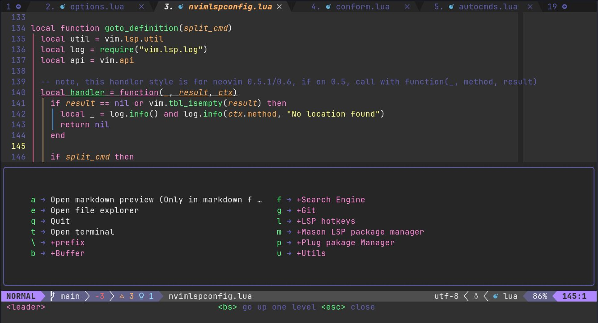
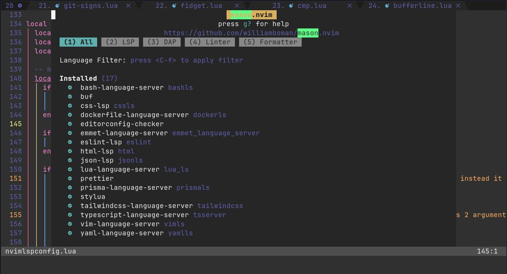

<h1 align="center">Neovim simple config</h1>

<div align="center">
    
    
    
    
    
    
</div>

## Prerequisites

- [Neovim](https://neovim.io/)
- [python3-pynvim](https://packages.debian.org/sid/python3-pynvim)
- [vim-plug](https://github.com/junegunn/vim-plug)
- [ripgrep](https://github.com/BurntSushi/ripgrep)

## Getting started

- Remove all neovim settings so as not to conflict with the new configuration using the command:

```sh
rm -rf ~/.local/share/nvim && rm -rf ~/.local/state/nvim
```

- Clone the repository to the directory `~/.config/nvim`, copy font to the directory
  `~/.fonts` and run nvim with the command:

```sh
git clone https://github.com/luCAOrx/neovim-config ~/.config/nvim && cp ~/.config/nvim/fonts/JetBrainsMonoNerdFontMono-Regular.ttf ~/.fonts/ && nvim
```

- Set Jet Brains Mono Nerd Font Mono Regular in your system config and terminal config.

:warning: Warning

> \*The font used in this configuration is: `JetBrainsMonoNerdFontMonoRegular`, the glyphs(icons)
> will appear when the font is selected, if you choose to use another font,
> use a monospace font so that the glyphs(icons) appear
> correctly, otherwise the glyphs(icons) will be cut in half. Fonts are
> available [here]('https://www.nerdfonts.com/font-downloads') and the glyphs(icons) are
> available [here]('https://www.nerdfonts.com/cheat-sheet').

- Install the plugins with the command: `:PlugInstall`, close Neovim with command: `:q` and press
  enter, run the command: `nvim` to reopen it.

A screen will open installing what is defined in the 'masonPackage' list in the file
[autocmds.lua]('./plugin/lua/autocmds.lua'), close Neovim and reopen it `nvim`, it is ready to use.

If you want to know what the shortcut keys are, click on the key `\`, a panel will open
with the mapped keys.
