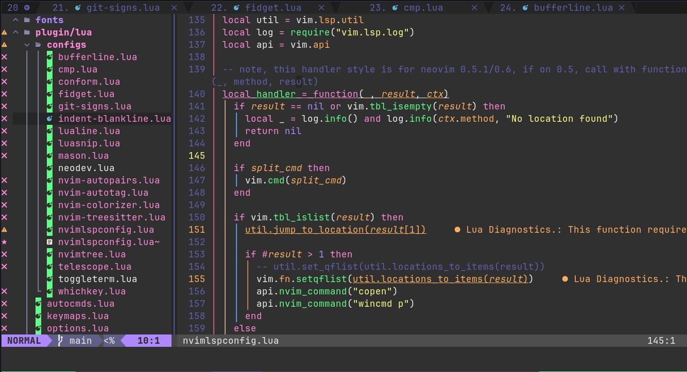

<h1 align="center">Neovim simple config</h1>

<div align="center">
    
    
    
    
    
    
</div>

## Prerequisites

- [Neovim](https://neovim.io/)
- [python3-pynvim](https://packages.debian.org/sid/python3-pynvim)
- [vim-plug](https://github.com/junegunn/vim-plug)
- [ripgrep](https://github.com/BurntSushi/ripgrep)

## Getting started

- On your home directory, enter the nvim directory using the command: `cd ~/.config/nvim`,
if this directory does not exist, create it using the command: `mkdir ~/.config/nvim`

- Clone the repository to the directory `~/.config/nvim`, move all contents to the nvim directory and
copy font to the directory `~/.fonts` with the command:
```sh
cd ~/.config/nvim && git clone https://github.com/luCAOrx/neovim-config && mv ~/.config/nvim/neovim-config/* ~/.config/nvim && rmdir ~/.config/nvim/neovim-config && cp -vr ~/.config/nvim/fonts/* ~/.fonts
```

:warning: **The font used in this configuration is: `JetBrainsMonoNerdFontMonoRegular`, the glyphs(icons)
will appear when the font is selected, if you choose to use another font,
use a monospace font so that the glyphs(icons) appear
correctly, otherwise the glyphs(icons) will be cut in half.** Fonts are
available [here]('https://www.nerdfonts.com/font-downloads') and the glyphs(icons) are
available [here]('https://www.nerdfonts.com/cheat-sheet').

- Open Neovim with the command: `nvim`

- Install the plugins with the command: `:PlugInstall`, close Neovim and reopen it.

A screen will open installing the LSP(Language Server Protocol)s defined in the
parameter 'ensure_installed' of function 'require(mason).setup({})'
in the file [mason.lua]('./plugin/mason.lua') close Neovim and reopen it, once all
this is done, it is ready to use.

If you want to know what the shortcut keys are, click on the key
`\` and wait 2 seconds, a panel will open with the mapped keys.
